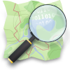

# OpenStreetMap Data Quality Scavenger Hunt
Presented to the CHATR Lab March 5, 2024.

## Goals

- Provide insight into OSM data generation and data structures.
- Critical look at data quality in our neighbourhoods.

## OpenStreetMap

- "The volunteered street map of the world" and "the wikipedia of maps".
- Open ended, flexible, extensive.
- Open Database License (ODbL) https://www.openstreetmap.org/copyright/
   - Provide credit
   - Make clear the data is available under ODbL
>You are free to copy, distribute, transmit and adapt our data, as long as you credit OpenStreetMap and its contributors. If you alter or build upon our data, you may distribute the result only under the same license.

## "Volunteered..."

- Editing takes time and effort.
- [The rise of corporate editors](https://www.mdpi.com/2220-9964/8/5/232).
- [Involuntary geographic information](https://doi.org/10.1080/00045608.2011.595657), [fauxtomation](https://logicmag.io/failure/the-automation-charade/), 
and [hidden labour](https://mitsloan.mit.edu/ideas-made-to-matter/hidden-work-created-artificial-intelligence-programs).

## VGI generation

- Editing is a great way to understand OSM.
- Key value pairs documented on the [wiki](https://wiki.openstreetmap.org/).
- E.g., [highway = cycleway](https://wiki.openstreetmap.org/wiki/Tag:highway%3Dcycleway).

## OSM data quality scavenger hunt. 

- As a starting point, choose on an area that you know and find interesting.
   - Home
   - Work
   - Family
   - Vacation
   - Shopping

#### ***Exercise 1.*** 
> On [OpenStreetMap.org](https://www.openstreetmap.org), zoom into a feature that is interesting to you, right click, click **query features** to view the tags. Take a screenshot, and paste it into the google doc for that scavenger hunt item. Please use one page or less!

#### ***Exercise 2.*** 

> Click on the tag to view the wiki.

#### ***Exercise 2.*** 

> Click on the editor's name to view their bio

## Scavenger hunt

**Prizes** *(vegan)*
1. Nanaimo bar
2. Chocolate chip cookie
3. Chocolate croissant

*Level 1: intro*

- [The tags of a feature that interests you](https://docs.google.com/document/d/1-nlcA7pEITME6mTbeNB9VeJbaGqFVXwl6vjtLAvuN5c/edit?usp=sharing).
- [The wiki page for a tag that interests you](https://docs.google.com/document/d/1GvRpsvmZKoKFserfXpxB8M9MnJHOMx51kSAnArZsOdY/edit?usp=sharing).
- [The bio of the person who last edited your feature of interest](https://docs.google.com/document/d/1G4jYFKUg7sj6GAK59WKXtR9pdf6MtqIMuw86SbQD7Pg/edit?usp=sharing).
----
*Level 2: examples provided*
- [The hot topic(s) in your area of interest.](https://docs.google.com/document/d/1Q2GHQYi7j7_SRhEQYMmPl-I23awbcVwdMhFv9P7s0ZY/edit?usp=sharing)
- [The bio of a super-contributor](https://docs.google.com/document/d/1Gq6Qqd6f1B4AEe4YPaTnL2w5Zsrn87NkrDIsbeE2d7k/edit?usp=sharing).
- [The bio of a corporate editor](https://docs.google.com/document/d/1FQrxCXeaZv6bUZmte9OSprjxs1BHxULhI5FoGxWsvJY/edit?usp=sharing).
- [An error on the map](https://docs.google.com/document/d/1Cb8V7JhEz9THIr58Hl0dpis3zbG91dQ4fhhskkkgJDE/edit?usp=sharing)!
   - Bonus point for fixing it.
----
*Level 3: on your own!*
- [An accessibility feature](https://docs.google.com/document/d/1QZRSIB6l_KgAj4TzZrXZNFeDSO_PDVYrnMgMzr6P0i0/edit?usp=sharing).
- [A gendered feature](https://docs.google.com/document/d/1S5hxFMuCthnt40lguAR9-Uvq42seKd6HG_aWCoHip7o/edit?usp=sharing).
- [A healthcare feature](https://docs.google.com/document/d/1Ke9ba6eDJ94F0FOlYSQXsJ0h_v4_QSycbpHC4tG0998/edit?usp=sharing).
- [A cultural feature](https://docs.google.com/document/d/1_mGvqwIfHHz9nVglwZLAYROcVbmK-2qyN7PuB766vnw/edit?usp=sharing).
- [An Indigenous feature](https://docs.google.com/document/d/1nYQdBa-OlayWKhv-H4e5pFwYOK5TxFJKDYoF_Za9KJw/edit?usp=sharing).
- [A recent change that is mapped](https://docs.google.com/document/d/1UjbLA_R-cJQQeXaFx3V5YLAds2ccOGO3esQFeTPimb0/edit?usp=sharing).
- [A recent change that is not mapped](https://docs.google.com/document/d/1030E8f6IxmRZixr9W0kHrducLkaWMbtCNaDvv8QbjPE/edit?usp=sharing).
   - bonus point for adding it!
- [Something that isn’t represented well due to limitations on the platform](https://docs.google.com/document/d/1lOZioRN9ZtDiaIfXF03F6oSXAhT4O2fCZp_5lEbKGgU/edit?usp=sharing).
